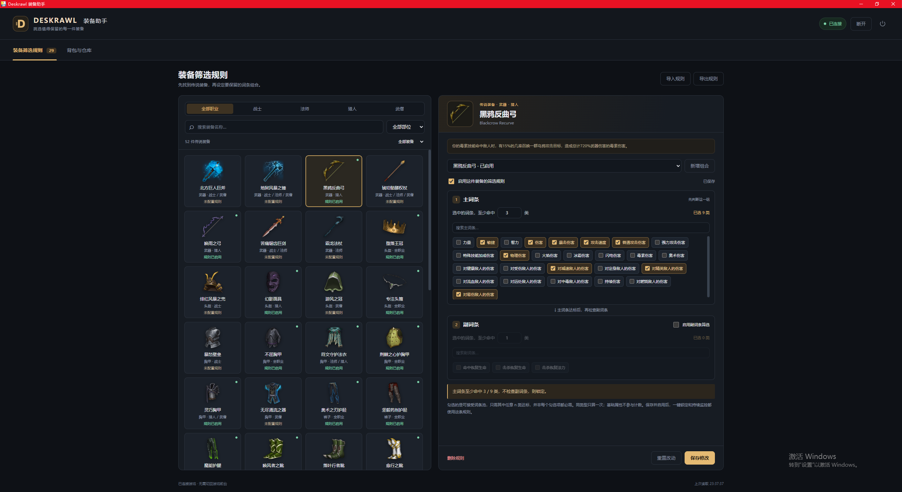
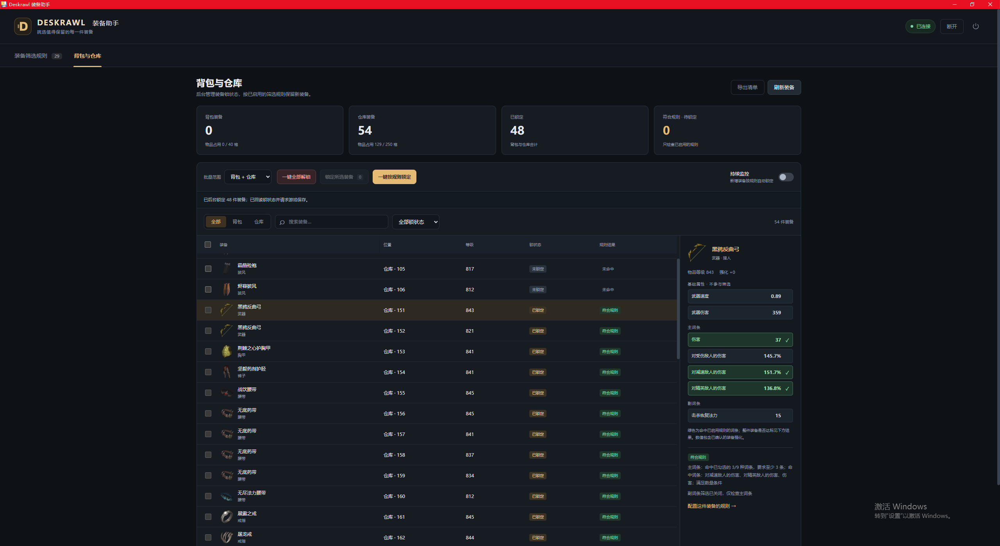

# Deskrawl 装备助手

Windows x64 装备筛选与物品整理工具，当前版本 **v1.1.5**，适配 **Deskrawl 1.0.2（Steam build 25817367）**。使用 WebView2 独立窗体显示网页界面，外部读取游戏的背包、仓库与马车，根据玩家配置锁定装备、移动和自动整理物品。

如果觉得本软件对你有帮助，欢迎在 [GitHub 项目](https://github.com/awesomehy/Deskrawl-Assistant) 点亮 **Star**，感谢支持！

## 快速使用

1. 打开 [Releases 下载页面](https://github.com/awesomehy/Deskrawl-Assistant/releases)，选择最新版；也可直接下载 [Deskrawl-Assistant-v1.1.5.exe](https://github.com/awesomehy/Deskrawl-Assistant/releases/download/v1.1.5/Deskrawl-Assistant-v1.1.5.exe)。
2. 双击 exe，稍等片刻即可打开助手窗体，无需安装 Python。若提示缺少 WebView2，请使用[微软官方安装程序](https://go.microsoft.com/fwlink/p/?LinkId=2124703)联网安装后重试。
3. 启动 Deskrawl 并进入角色，在助手顶部点击“连接游戏”，自动读取背包与仓库。主城和战斗场景均可使用。
4. 进入“装备筛选规则”，按职业、部位或名称选择装备；勾选主词条并设置“至少命中 n 类”，按需启用副词条，保存并启用规则。每件装备可新增多个命名组合；任意一个启用组合满足即符合规则。
5. 进入“背包与仓库”，点击“一键按规则锁定”检查已有装备；需要自动处理后续新装备时，开启“持续监控”。点击装备可查看数值、命中高亮及筛选结果。
6. 勾选背包或仓库物品后点击“移入仓库”或“取回背包”。展开“自动整理”，配置马车收取、宝石自动入库、背包容量整理，点击“保存整理设置”后再“启动自动整理”。马车物品可按类型和搜索结果全选 / 全不选。
7. 进入“日志”查看观测到的新物品、逐件锁定与搬运记录，可按分类和名称搜索、查看历史。保持连接即可记录，无需开启自动锁定或整理。

从 v1.1.4 或更早版本升级时，请保存设置并通过助手右上角退出旧版，再运行 v1.1.5。v1.1.5 起会自动检查更新，之后发现更高版本时可在顶部「下载并更新（重启）」。个人规则、整理设置和日志会保留；重启后监控与自动整理默认暂停，需要重新开启。各版本的更新记录和适配范围见对应 Release 页面。

## 使用截图

**装备筛选规则**：按职业、部位或名称找到装备，再配置可接受的主副词条及命中数量。



**背包与仓库**：批量管理装备锁定状态，查看装备数值与筛选结果；绿色和 ✓ 表示命中规则的词条。



## 功能

- 顶部显示连接按钮与游戏连接状态；连接后自动读取背包和仓库。
- 顶部自动检查本项目 GitHub 正式 Release，启动后检查、每小时重查，并提供手动检查。发现新版本可一键下载到当前程序目录，校验后替换当前 exe 并重启；规则、整理设置和日志保留。更新保留原文件名；源码模式只查看更新信息。
- 「背包与仓库」显示金色「✦ 主词条全中」并支持筛选：四条随机主词条必须全部命中同一个启用组合，不检查副词条，不拼接组合或计入基础属性。此标记不改变自动锁定条件。
- 按职业、部位、名称筛选 52 件传说装备，并显示游戏装备图标。
- 为每件装备勾选可接受的主词条类型，配置“至少命中 n 类（≥n）”。同类型只计一次，任意 n 类符合即可。
- 副词条可选；启用时，主词条和副词条两组均达标才锁定。
- 每件装备可建立多个可命名词条组合，支持新增、复制、改名、独立启用 / 停用和删除。所有启用组合按“任意一个满足即可”判断；装备预览注明命中的组合，旧版规则及多组合导入导出保持兼容。
- 装备详情显示词条数值与百分比，包含已经核验的装备强化换算；命中已启用规则的词条显示绿色和 ✓，部分命中也会高亮。
- 基础护甲、基础武器伤害与速度单独显示，不参与主副词条计数或高亮。
- 背包和仓库支持全部解锁、锁定所选装备、按规则锁定，以及持续监控新增装备。
- 支持背包与仓库双向移动实体装备、材料、宝石、符文和宝箱；保留数量、装备词条、强化和锁定状态。
- 同种同等级宝石优先合并仓库中的堆叠，按游戏当前上限处理（1.0.2 为每组 99 颗），满堆后使用已开放的空格。
- 按物品名称将马车物品自动收进背包；按类型、名称筛选后可全选 / 全不选当前结果，保留其他选择。
- 背包宝石自动入库；背包快满时装备自动入库，可配置触发剩余空格、预留空格目标及全部 / 已锁定 / 未锁定装备范围。
- 内置 36 种宝石和 199 种符文的图标、效果说明，包含游戏 1.0.2 新增的 48 种技能符文。
- 支持规则导入导出、清单导出、停止操作与操作记录。
- 独立「日志」页签：连接后每 2 秒观察背包、仓库和马车，记录观测到的新增物品与堆叠数量增量；首次清单作为基线，不将现有物品算作新增。无需开启自动锁定或自动整理。
- 锁定 / 解锁逐件记录；手动及自动转移逐次记录名称、来源和目标格位、转移数量、前后数量及合并堆叠。马车收取按实际目标格位记录，拆分堆叠分条显示。已确认转移在后续读取出错时仍保留记录。
- 日志支持分类、名称 / 操作搜索和历史分页，保存在本机 SQLite 数据库，重启后仍保留。工具自己的搬运不会再次算作新增掉落。

获取记录基于每次完整读取的差异；两次读取之间瞬时出现又消失的物品可能无法捕获。工具确认完成的搬运逐次记录，不依赖之后的定时观察。

操作不要求游戏位于前台或打开背包，不占用鼠标键盘。持续监控默认关闭；开启后先记录当前装备，再检查新增装备。自动整理是独立开关，偏好保存后每次重启仍默认暂停。停止操作、断开连接、退出或全部解锁会停止自动操作。

战斗中物品变化导致读取不同步时，工具最多即时重读三次；仍在变化则保留监控、自动整理和待锁装备，等待下一轮。数据布局或稳定数据的完整性错误仍停止操作。

## 使用与数据保存

在 [GitHub Releases](https://github.com/awesomehy/Deskrawl-Assistant/releases) 下载打包好的程序，推荐使用 [v1.1.5](https://github.com/awesomehy/Deskrawl-Assistant/releases/tag/v1.1.5) 的 exe。直接双击即可打开窗体，无需安装 Python。页面每个版本只上传 exe，并提供更新记录；缺少 WebView2 时，可使用[微软官方安装程序](https://go.microsoft.com/fwlink/p/?LinkId=2124703)联网安装。

历史版本 v1.1.0、v1.1.1 提供原始发布程序；这两个标签只保存发行说明和组件许可，没有对应构建时的完整源码快照。v1.1.2 起的标签提供各自完整源码，适配范围见对应 Release。

发行版规则、自动整理设置与日志保存在 `%LOCALAPPDATA%\Deskrawl装备助手\`，移动或更新 exe 后仍保留。源代码版保存到工作目录的 `config/` 和 `data/runtime/`，这些个人文件不纳入仓库。全新启动没有任何启用的筛选规则。

助手界面和服务在本机运行，默认地址为 `http://127.0.0.1:18741/`。重复启动复用已有助手；关闭窗体会退出服务并停止监控，最小化时监控继续。手动升级时先退出旧版再打开新版；顶部的一键更新会自动完成退出、替换和重启，需要当前程序目录可写。

## 从源码运行

使用 **Windows 和 64 位 Python 3.12**；已验证的构建环境为 Python 3.12.14。

```powershell
python -m venv .venv
.\.venv\Scripts\python.exe -m pip install -r requirements-runtime.txt
.\.venv\Scripts\pythonw.exe run_assistant.pyw
```

也可在创建 `.venv` 并安装依赖后双击 `启动装备助手.cmd`。

## 测试

```powershell
.\.venv\Scripts\python.exe -m unittest discover -s tests -q
```

当前包含 232 项自动检查，使用合成或脱敏用例及模拟内存，不要求运行游戏或提供个人装备数据。检查覆盖多组合任一命中和持久化、日志分页和精确数量、获取 / 搬运去重、提交后读取失败的记录保留，以及既有的规则计数、数值、身份验证、锁定、堆叠、马车收取、自动整理和读取变化重试。

已另外验证单文件 exe 在独立中文目录及没有外部 Python 的环境启动，并只读连接实际游戏。背包 / 仓库互转、宝石堆叠和马车收取已在实际游戏验证，v1.1.3 已由用户测试验收。尚未在另一台电脑或全新 Windows 虚拟机上测试。

## 构建单文件 exe

```powershell
python -m venv .build-venv
.\.build-venv\Scripts\python.exe -m pip install -r requirements-build.txt
Invoke-WebRequest -Uri 'https://go.microsoft.com/fwlink/p/?LinkId=2124703' -OutFile 'packaging/MicrosoftEdgeWebview2Setup.exe'
.\.build-venv\Scripts\python.exe tools/build_exe.py
```

构建结果输出到 `release/`，包含单文件 exe、使用说明、第三方许可和可选的官方 WebView2 安装程序。资源清单只包含必要静态字典、网页和 444 张图标（209 张装备、36 张宝石、199 张符文），个人规则、装备快照、日志及游戏程序均不打包。

可用以下命令验证打包后的独立窗体与数据持久化；最后一项需要本机正在运行受支持的游戏：

```powershell
.\.build-venv\Scripts\python.exe tools/smoke_exe.py --desktop
.\.build-venv\Scripts\python.exe tools/smoke_exe.py --desktop --connect-game
```

## 适配范围

当前适配 Deskrawl 1.0.2（Steam build 25817367）；读取前会核对程序和元数据哈希。游戏更新后需要重新核验，版本不匹配时拒绝写入。

- `GameAssembly.dll` SHA256：`c242676ed070072388b4231a5c215812c8bc3d53c21f9277c7c0afa4fa4fa2da`
- `global-metadata.dat` SHA256：`2c0ae47e1ee26b6c787d5294f04680b6b875d84e8d5f6db1e574446892e3f2ad`

锁定动作会重新核验装备身份和字段，写入锁状态及游戏待保存标记，并回读确认。游戏自身负责正常保存；游戏锁图标可能在重新打开背包后刷新。

当前规则只按词条类型计数，不提供数值门槛。未揭示黑雾、词条分组无法确认或读取不完整的装备不自动锁定；已经出售或分解的装备无法追回。披风的已验证随机词条池为空，暂不支持该部位的词条筛选。切换角色后请关闭再开启监控，以重建基线。

只搬运实体物品；游戏按计数器保存的货币和虚拟材料不属于背包格子。马车收取需要背包空位；仓库空间不足时自动整理等待。游戏自己的马车出售 / 分解设置仍会生效。

符文预览显示 1 级基础效果、成长及技能 / 套装说明，暂不计算特定符文实例的实际等级效果或当前角色是否激活套装。

## 代码与资源

| 路径 | 内容 |
| --- | --- |
| `deskrawl_assistant/web/` | 网页界面、图标、数值与高亮展示 |
| `deskrawl_assistant/web_service.py` | 筛选规则与背包/仓库操作 |
| `deskrawl_assistant/native_window.py` | WebView2 窗体与单实例管理 |
| `deskrawl_assistant/native_reader.py` | 外部只读装备读取 |
| `deskrawl_assistant/background_lock.py` | 经身份校验的锁状态写入 |
| `deskrawl_assistant/container_transfer.py` | 背包 / 仓库互转与宝石堆叠 |
| `deskrawl_assistant/carriage_transfer.py` | 马车物品收取 |
| `deskrawl_assistant/automation.py` | 整理设置验证与背包容量规划 |
| `deskrawl_assistant/activity_journal.py` | 本机持久日志、物品变化观察与搬运去重 |
| `deskrawl_assistant/stat_display.py` | 数值、百分比与强化显示换算 |
| `data/` | 必要静态字典和版本结构信息 |
| `tests/` | 自动检查与脱敏测试用例 |
| `packaging/`、`tools/build_exe.py` | Windows 构建设置与脚本 |

部分旧界面源码保留用于兼容和排查。`tools/verify_container_transfer.py`、`tools/verify_carriage_transfer.py` 用于搬运功能的开发验证；日常操作已接入 v1.1.3 窗体。

资源提取工具只读解析本地游戏安装文件，额外依赖 `requirements-unity.txt`；日常运行无需 UnityPy。版本变更见 [版本记录](docs/版本记录.md)，第三方资源说明见 [NOTICE.md](NOTICE.md)。

## 贡献

欢迎通过提 [Issue](https://github.com/awesomehy/Deskrawl-Assistant/issues) 或 [Pull Request](https://github.com/awesomehy/Deskrawl-Assistant/pulls) (如果提供了仓库链接) 的方式贡献代码、报告 Bug 或提出建议。

## 许可证

本项目软件采用 [AGPL-3.0](LICENSE) 许可证。
